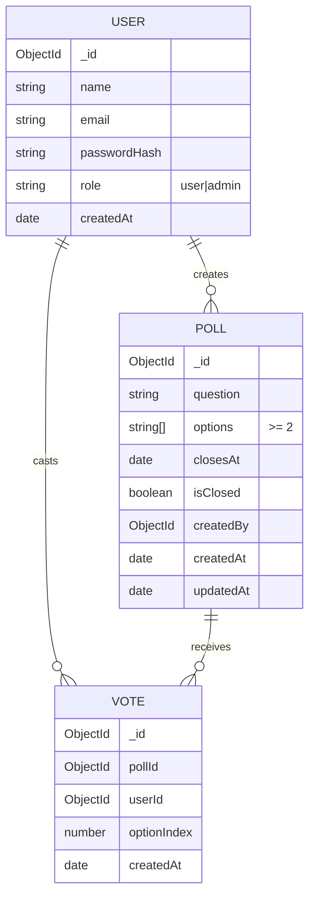

# 🗳️ Poll & Voting App

A full-stack web app where **Admins** create/manage polls and **Users** vote once per poll.  
When a poll closes (time or admin toggle), voters can see final results as a static summary (bar chart / counts).

**Live:**  
- **Frontend (Netlify):** https://vote-poll-stack.netlify.app  
- **Backend (Render):** https://vote-polling-pvcc.onrender.com

---
## 🎥 Demo Video

Watch the complete working demo of the **Poll & Voting App (MERN Stack)** here 👇  

🔗 **[Click to Watch Demo Video](https://drive.google.com/file/d/1yofsnDZYtjjYXuC7Uv0sgcHFfAzxYXYO/view?usp=sharing)**  
## ⚙️ Setup & Installation

```bash
# Clone repository
git clone https://github.com/yourusername/poll-voting-app.git
cd poll-voting-app/backend

# Install dependencies
npm install

# Setup environment variables
echo "MONGO_URI=mongodb://127.0.0.1:27017/pollApp" > .env
echo "JWT_SECRET=mysecretkey" >> .env
echo "PORT=5000" >> .env

# Run server
npm run dev
```

✅ Server runs on **http://localhost:5000**

---

## ✨ Features

- 🔐 Secure Auth (Register/Login) with roles: **user**, **admin**
- 🧑‍💼 Admin: Create / Edit / Delete polls, set **closing date-time** or **manual close**
- 🙋‍♂️ Users: See **open polls**, cast **one vote** per poll, see **results after close**
- 📊 Results shown as static summary (bar chart / count list)
- ✅ Clean validation & error handling
- 📱 Fully responsive UI (mobile + desktop)

---

## 🧰 Tech Stack (and Why)

| Layer | Technologies | Reason |
|--------|---------------|--------|
| **Frontend** | React + Vite, React Router, Context API, Axios, Tailwind | Fast build setup (Vite), easy state (Context), sleek design (Tailwind) |
| **Backend** | Node.js, Express, Mongoose | Lightweight REST APIs, familiar Mongo stack |
| **Database** | MongoDB Atlas | Easy cloud-hosted NoSQL DB with flexible schema |
| **Auth** | JWT | Secure, stateless login |
| **Deploy** | Netlify (FE), Render (BE) | Free, easy CI/CD deployment |

---

## 🗄️ ER / Data Model



---

## 🔗 API Endpoints

### 🧍‍♂️ Auth Routes

| Method | Endpoint | Description |
|--------|-----------|-------------|
| `POST` | `/api/auth/register` | Register a new user |
| `POST` | `/api/auth/login` | Login and receive a JWT token |

---

### 📊 Poll Routes

| Method | Endpoint | Description | Auth Required |
|--------|-----------|-------------|----------------|
| `POST` | `/api/polls/create` | Create a new poll | ✅ |
| `GET`  | `/api/polls` | Get all polls | ❌ |
| `POST` | `/api/polls/vote` | Vote on a poll | ✅ |

---

## 🧾 Example Poll Object

```json
{
  "_id": "6745abc12345",
  "question": "Which frontend framework do you prefer?",
  "options": [
    { "text": "React", "votes": 4 },
    { "text": "Vue", "votes": 2 },
    { "text": "Angular", "votes": 1 }
  ],
  "createdBy": "673aa7890f5",
  "createdAt": "2025-11-10T14:30:00.000Z"
}
```

---

## 🧪 Testing

Use **Postman** or **Thunder Client** (VS Code extension):

1. Register a new user — `/api/auth/register`  
2. Login to get JWT token — `/api/auth/login`  
3. Create a poll (send token in header) — `/api/polls/create`  
4. Fetch all polls — `/api/polls`  
5. Vote on poll — `/api/polls/vote`

---

## 🖥️ Deployment (Optional)

You can deploy easily using:

- [Render](https://render.com/)
- [Railway](https://railway.app/)
- [Vercel (Serverless)](https://vercel.com/)

---

## 👨‍💻 Author

**Ashish Chaudhary**  
📧 [ashishknp1010@gmail.com](mailto:ashishknp1010@gmail.com)  
🌐 [linkedin.com/in/ashish-chaudhary-knp12](https://www.linkedin.com/in/ashish-chaudhary-knp12)

---

✅ *Fully functional backend ready for your Poll & Voting App!*
